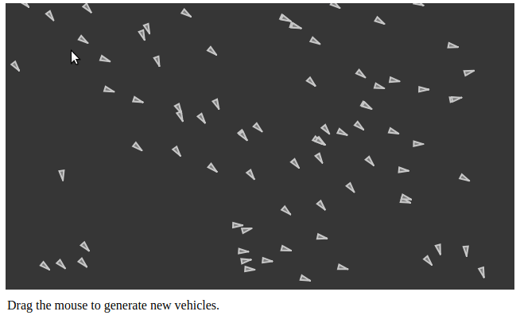
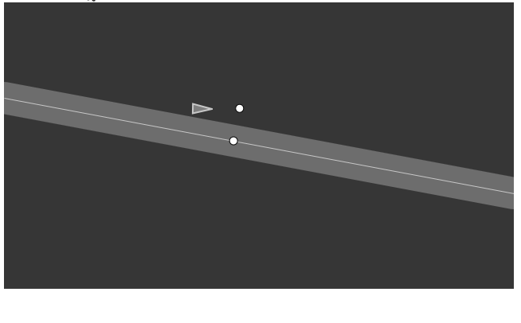
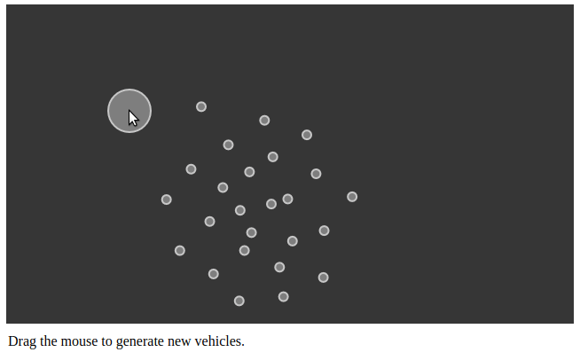
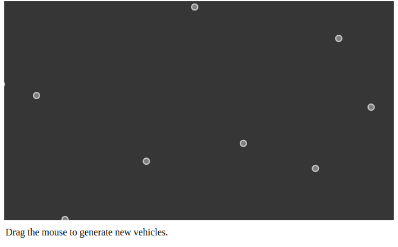

# Nature Of Code - (Autonomous agent)
Autonomous agent generally refers to an entity that makes its own choices about how to act in its environment without any influence from a leader or global plan.

## Prerequisites
  p5.js :- A JavaScript library that starts with the original goal of Processing to make coding accessible for artists, designers, educators, and beginners, and reinterprets this for today's web.

## Example

### Flocking

### FlowField

### Path Follow

### Seek

### Seek & Seperation

### Seperation

